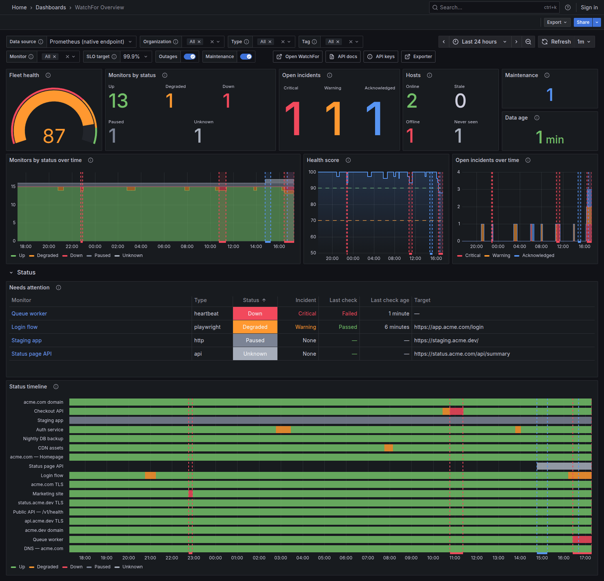

# watchfor-prometheus-exporter

[](https://github.com/watchfor-io/prometheus-exporter/actions/workflows/ci.yml)
[](https://github.com/watchfor-io/prometheus-exporter/releases/latest)
[](LICENSE)

Prometheus exporter for [WatchFor](https://watchfor.io) uptime monitoring.
It polls WatchFor's Prometheus endpoint (`GET /api/v1/metrics`) for one or
more organizations, adds an `organization` label to every series, and
serves the merged result on `/metrics`, together with metrics about its own
polling. One static binary or a small distroless container; outbound HTTPS
only, one listening port.

It does not compute anything itself and it never calls the REST API. The
numbers are the ones WatchFor serves: monitor status, incident-based uptime,
latest checks, response times, certificate and domain expiry, heartbeats,
hosts, fleet health and open incidents. A ready-made
[Grafana dashboard](#grafana-dashboard) comes with it.

- [Do you need it?](#do-you-need-it)
- [Quick start](#quick-start): [binary](#binary), [Docker](#docker),
  [Docker Compose with Prometheus and Grafana](#docker-compose-with-prometheus-and-grafana),
  [Kubernetes](#kubernetes)
- [Configuration](#configuration)
- [Metrics](#metrics)
- [Prometheus configuration](#prometheus-configuration)
- [How polling works](#how-polling-works)
- [Troubleshooting](#troubleshooting)

## Do you need it?

Often not. Prometheus can scrape WatchFor directly: the endpoint speaks the
Prometheus text format and takes the API key as a bearer token, so a
`scrape_config` with an `authorization` block is all it takes (see
[Prometheus configuration](#prometheus-configuration)). With one
organization and a Prometheus that can read a credentials file, that is
the simpler setup, and this exporter adds nothing to the data.

The exporter is for the cases where direct scraping is awkward:

- **Several WatchFor organizations** behind one scrape target, each with its
  own key, every series labelled with the organization it came from.
- **Keys kept out of the Prometheus configuration**, for example in a
  Kubernetes Secret mounted only into the exporter, or when the Prometheus
  config lives in a repository many people can read.
- **One in-cluster target** that a `ServiceMonitor` or any service
  discovery can find, instead of an external URL with credentials.
- **Visibility into the polling itself**: `watchfor_exporter_up` and
  `watchfor_exporter_poll_errors_total{reason}` say whether the data
  stopped because of a revoked key, a plan change, rate limiting or the
  network.

It does not make the data fresher. WatchFor computes the response at most
once a minute per organization and serves it from a cache in between; the
exporter polls once per interval (60 s by default and at minimum) and serves
what it got.

### Requirements

- A WatchFor organization on the **Pro, Business or Enterprise** plan. On
  other plans the endpoint answers `403`.
- An API key of that organization, created in the dashboard under
  **Settings → API keys**. A key with the `read` scope is enough. A key used
  only by the exporter is easiest to rotate and keeps its rate limit to
  itself.
- Outbound HTTPS to `watchfor.io`. `HTTPS_PROXY` / `NO_PROXY` are honoured.

## Quick start

### Binary

Download the archive for your platform from the
[releases page](https://github.com/watchfor-io/prometheus-exporter/releases)
(Linux, macOS and Windows; amd64 and arm64), unpack it and run:

```sh
export WATCHFOR_API_KEY=wf_live_...
./watchfor-prometheus-exporter
```

The first poll happens within a few seconds of startup. Then:

```sh
curl -s localhost:10056/metrics | grep -E '^watchfor_(exporter_up|monitors)'
```

```
watchfor_exporter_up{organization="default"} 1
watchfor_monitors{organization="default",status="down"} 0
watchfor_monitors{organization="default",status="up"} 12
...
```

`WATCHFOR_ORGANIZATION=acme` sets the label value instead of `default`.

### Docker

```sh
docker run -d --name watchfor-exporter -p 10056:10056 \
  -e WATCHFOR_API_KEY=wf_live_... \
  --read-only --cap-drop=ALL --security-opt no-new-privileges \
  ghcr.io/watchfor-io/prometheus-exporter:latest
```

To keep the key out of `docker inspect`, mount it as a file instead:

```sh
docker run -d --name watchfor-exporter -p 10056:10056 \
  -v "$PWD/watchfor-api-key:/run/secrets/watchfor-api-key:ro" \
  -e WATCHFOR_API_KEY_FILE=/run/secrets/watchfor-api-key \
  ghcr.io/watchfor-io/prometheus-exporter:latest
```

The container runs as uid 65532, so the file must be readable by that user
(for example `chmod 0644`, or owned by 65532).

For several organizations, mount a config file:

```sh
docker run -d -p 10056:10056 \
  -v "$PWD/config.yml:/etc/watchfor/config.yml:ro" \
  -v "$PWD/keys:/etc/watchfor/keys:ro" \
  ghcr.io/watchfor-io/prometheus-exporter:latest --config.file=/etc/watchfor/config.yml
```

The image is published for linux/amd64 and linux/arm64, tagged with the
version (`0.1.0`), the minor version (`0.1`) and `latest`.

### Docker Compose with Prometheus and Grafana

[`examples/docker-compose.yml`](examples/docker-compose.yml) runs the
exporter, Prometheus and Grafana with a Prometheus data source already set
up:

```sh
cd examples
export WATCHFOR_API_KEY=wf_live_...
docker compose up -d
```

- Exporter: <http://localhost:10056/metrics>
- Prometheus: <http://localhost:9090> (try `watchfor_monitor_up`)
- Grafana: <http://localhost:3000>, `admin` / `admin` on first login

### Kubernetes

[`examples/k8s/`](examples/k8s) has a Secret, a ConfigMap, a Deployment with
its Service, and a `ServiceMonitor` for the Prometheus Operator.

```sh
kubectl -n monitoring create secret generic watchfor-api-keys \
  --from-literal=acme=wf_live_...
# edit examples/k8s/configmap.yaml: one target per key in the Secret
kubectl apply -k examples/k8s -n monitoring
```

The kustomization leaves `secret.yaml` out on purpose, so re-applying the
directory never replaces your key with the placeholder in that file.

Notes on the manifests:

- One replica. Every replica polls every organization, and nothing is
  gained from more.
- The pod runs as non-root with a read-only root filesystem, no
  capabilities and no service account token. The Secret is mounted with
  mode 0440 and `fsGroup: 65532` so the exporter's user can read it.
- **Key rotation needs no restart.** The exporter re-reads `api_key_file`
  on every poll, and the kubelet updates mounted Secret files in place
  (usually within a minute or two).
- `readinessProbe` uses `/readyz`, so a new pod is not Ready until its first
  successful poll, and a rollout with a broken configuration does not
  replace a working pod. The Service sets `publishNotReadyAddresses: true` so Prometheus still
  scrapes a pod whose polls fail; otherwise the pod would drop out of the
  Service and take `watchfor_exporter_up == 0` with it.
- The `ServiceMonitor` carries `release: kube-prometheus-stack`. Your
  Prometheus resource may select a different label; check its
  `serviceMonitorSelector`.

Without the Prometheus Operator, add a scrape job for
`watchfor-prometheus-exporter.monitoring.svc:10056` (see
[Prometheus configuration](#prometheus-configuration)).

## Configuration

Settings come from four places. Later ones override earlier ones:

1. built-in defaults,
2. the YAML file (`--config.file` or `WATCHFOR_EXPORTER_CONFIG`),
3. environment variables,
4. command-line flags.

Everything is validated at startup and every problem is reported at once;
the exporter exits with status 2 on an invalid configuration. API keys
never appear in log lines or error messages.

### Flags

| Flag | Default | Meaning |
|---|---|---|
| `--config.file` | none | YAML config file |
| `--web.listen-address` | `:10056` | where `/metrics`, `/healthz` and `/readyz` are served |
| `--poll.interval` | `60s` | how often each organization is polled; values below 60s are refused |
| `--poll.timeout` | `30s` | timeout for one poll; must be shorter than the interval |
| `--log.level` | `info` | `debug`, `info`, `warn` or `error` |
| `--log.format` | `text` | `text` or `json` (logs go to stderr) |
| `--version` | | print the version and exit |

### Environment variables

| Variable | Meaning |
|---|---|
| `WATCHFOR_API_KEY` | API key for a single organization (quick start) |
| `WATCHFOR_API_KEY_FILE` | path to a file holding that key instead |
| `WATCHFOR_ORGANIZATION` | label value for that organization (default `default`) |
| `WATCHFOR_BASE_URL` | base URL for that organization (default `https://watchfor.io`) |
| `WATCHFOR_EXPORTER_CONFIG` | YAML config file, like `--config.file` |
| `WATCHFOR_EXPORTER_LISTEN_ADDRESS` | like `--web.listen-address` |
| `WATCHFOR_EXPORTER_INTERVAL` | like `--poll.interval` |
| `WATCHFOR_EXPORTER_TIMEOUT` | like `--poll.timeout` |
| `WATCHFOR_EXPORTER_LOG_LEVEL` | like `--log.level` |
| `WATCHFOR_EXPORTER_LOG_FORMAT` | like `--log.format` |

The four `WATCHFOR_*` target variables describe exactly one organization.
They cannot be combined with `targets` in a config file; the exporter
refuses to start rather than guess which one you meant.

### Config file

A complete, commented example is in
[`examples/config.example.yml`](examples/config.example.yml).

```yaml
listen_address: ":10056"
interval: 60s
timeout: 30s
log:
  level: info
  format: json
targets:
  - organization: acme
    api_key_file: /etc/watchfor/keys/acme
  - organization: acme-staging
    api_key_file: /etc/watchfor/keys/acme-staging
    filters:
      tag: [api, web]
      type: http,ssl
      include_hosts: false
```

| Field | Default | Meaning |
|---|---|---|
| `listen_address` | `:10056` | |
| `interval` | `60s` | Go duration (`60s`, `2m`); a bare number is refused, because YAML would read it as nanoseconds |
| `timeout` | `30s` | |
| `log.level`, `log.format` | `info`, `text` | |
| `targets[].organization` | required | value of the `organization` label on this target's series; unique across targets, up to 128 bytes, any printable UTF-8 |
| `targets[].api_key_file` | | file holding the key; read on every poll; surrounding whitespace ignored |
| `targets[].api_key` | | the key inline (prefer `api_key_file`); exactly one of the two is required |
| `targets[].base_url` | `https://watchfor.io` | must be `https`; plain `http` is accepted only for `localhost` and loopback addresses |
| `targets[].filters.tag` | all | only monitors carrying one of these tags |
| `targets[].filters.type` | all | only these monitor types (`http`, `ssl`, `heartbeat`, ...) |
| `targets[].filters.monitor_id` | all | only these monitors |
| `targets[].filters.include_hosts` | `true` | `false` leaves the `watchfor_host_*` families out |

Filters are passed to WatchFor as query parameters and applied there. Each
takes a YAML list or a comma-separated string. They narrow the per-monitor
series only; organization totals (`watchfor_monitors`,
`watchfor_health_score`, incidents, `watchfor_hosts`) always cover the
whole organization.

Unknown fields are an error, so a typo such as `apikey:` is caught at
startup instead of silently ignored.

## Metrics

### From WatchFor

Everything the endpoint serves is passed through unchanged, with one label
added: `organization`, the value configured for that target. The families,
as of this release:

| Family | Labels | Meaning |
|---|---|---|
| `watchfor_organization_info` | `exported_organization` (slug), `plan` | always 1 |
| `watchfor_monitors` | `status` | monitors by status: up, degraded, down, paused, unknown |
| `watchfor_health_score` | | fleet health score 0–100, as on the dashboard |
| `watchfor_incidents_firing` | `severity` | firing incidents, critical or warning |
| `watchfor_incidents_acknowledged` | | acknowledged incidents still open |
| `watchfor_maintenance_windows_active` | | maintenance windows in progress |
| `watchfor_hosts` | `state` | hosts online, stale, offline, never reported |
| `watchfor_monitor_info` | `monitor_id`, `name`, `type`, `target`, `tags`, `strategy` | always 1; the only series with names |
| `watchfor_monitor_up` | `monitor_id` | 1 unless a confirmed critical incident is open; absent while paused |
| `watchfor_monitor_state` | `monitor_id` | 0 down, 1 degraded, 2 up, 3 paused, 4 unknown |
| `watchfor_monitor_paused` | `monitor_id` | 1 when paused |
| `watchfor_monitor_open_incident_severity` | `monitor_id` | 0 none, 1 warning, 2 critical |
| `watchfor_monitor_check_interval_seconds` | `monitor_id` | configured interval |
| `watchfor_monitor_last_check_timestamp_seconds` | `monitor_id` | when the latest check ran (last 6 h) |
| `watchfor_monitor_last_check_success` | `monitor_id` | raw result of the latest check from one location |
| `watchfor_monitor_last_check_duration_seconds` | `monitor_id` | duration of the latest check |
| `watchfor_monitor_checks_24h` | `monitor_id`, `result` | checks in the last 24 h, success or failure |
| `watchfor_monitor_avg_duration_24h_seconds` | `monitor_id` | mean check duration over 24 h |
| `watchfor_monitor_uptime_ratio` | `monitor_id`, `window` | 0–1 over `24h`, `7d`, `30d`, incident-based |
| `watchfor_ssl_certificate_expiry_timestamp_seconds` | `monitor_id` | SSL monitors: certificate expiry |
| `watchfor_domain_expiry_timestamp_seconds` | `monitor_id` | domain monitors: registration expiry |
| `watchfor_heartbeat_last_ping_timestamp_seconds` | `monitor_id` | heartbeat monitors: last check-in |
| `watchfor_host_info` | `host_id`, `name`, `os`, `arch`, `agent_version` | always 1 |
| `watchfor_host_up` | `host_id` | 1 when the agent reported within its liveness window |
| `watchfor_host_last_seen_timestamp_seconds` | `host_id` | the agent's last push |
| `watchfor_scrape_generated_timestamp_seconds` | | when WatchFor computed the response; shows the cache age |
| `watchfor_scrape_duration_seconds` | | server time to compute it |

The WatchFor documentation describes them in full:
[watchfor.io/docs/api/prometheus](https://watchfor.io/docs/api/prometheus).
When WatchFor adds a family, the exporter passes it on without an upgrade.

Alert on `watchfor_monitor_up`, not on `watchfor_monitor_last_check_success`:
WatchFor confirms an outage from several locations before it opens an
incident, and a single failed check is not an outage.

### Labels

`watchfor_organization_info` already has a label called `organization`
(the organization's slug). The exporter keeps it as
`exported_organization` — the same renaming Prometheus itself applies when
a scraped label collides with a target label — so the slug is not lost:

```
watchfor_organization_info{exported_organization="acme-inc",organization="acme",plan="pro"} 1
```

Per-object series carry only an id. Join the names in when you need them,
including `organization` in the match so that ids from different
organizations never meet:

```promql
watchfor_monitor_up == 0
  * on (organization, monitor_id) group_left (name, type, target)
watchfor_monitor_info
```

### From the exporter

| Metric | Labels | Meaning |
|---|---|---|
| `watchfor_exporter_up` | `organization` | 1 if the last poll succeeded, 0 otherwise |
| `watchfor_exporter_last_success_timestamp_seconds` | `organization` | Unix time of the last successful poll; 0 until the first |
| `watchfor_exporter_poll_duration_seconds` | `organization` | duration of the last poll |
| `watchfor_exporter_poll_errors_total` | `organization`, `reason` | failed polls; `reason` is `auth`, `plan`, `rate_limited`, `http`, `network` or `parse` |
| `watchfor_exporter_build_info` | `version`, `revision`, `goversion` | always 1 |

Every `organization` × `reason` counter exists from startup at 0, so
`increase()` and `rate()` work from the first error. The standard `go_*` and
`process_*` metrics of the exporter process are included too.

Useful expressions:

```promql
# Polling broken for an organization
watchfor_exporter_up == 0

# Age of the data, including WatchFor's 60 s cache
time() - watchfor_scrape_generated_timestamp_seconds

# Why polls fail
increase(watchfor_exporter_poll_errors_total[1h]) > 0
```

[`examples/alerts.yml`](examples/alerts.yml) has example alerting rules.

### Grafana dashboard

[`dashboards/watchfor-overview.json`](dashboards/watchfor-overview.json) is a
ready-made dashboard for these metrics. It works with direct scraping and
through the exporter (with or without the `organization` label).



- **Fleet at a glance:** health score, monitors by status, open incidents,
  hosts, active maintenance and the age of the data, with trends over time.
- **Status:** a "needs attention" table and a status timeline per monitor.
- **Uptime and SLO:** 24 h, 7 d and 30 d uptime per monitor against an SLO
  target you pick (99 % to 99.99 %), with the error budget left.
- **Performance:** check duration over time and a 24-hour table with
  failures, success rate and whether each monitor is checking on schedule.
- **Certificates, domains and heartbeats:** days until expiry (red under 7,
  amber under 30) and time since the last heartbeat.
- **Hosts:** inventory, state and an availability timeline.
- Filters by organization, monitor type, tag and monitor; every panel has a
  hover description; outages and maintenance appear as annotations; rows
  link straight to the monitor or host in WatchFor.

Import it in Grafana under **Dashboards → New → Import** and pick your
Prometheus data source. The [Docker Compose example](#docker-compose-with-prometheus-and-grafana)
loads it automatically. Tested on Grafana 11.6, 12.2 and 13.2.

## Prometheus configuration

Use one of the two per organization, not both, or every series is stored
twice. Both are in [`examples/prometheus.yml`](examples/prometheus.yml).

**Directly from WatchFor**, no exporter. Prometheus holds the key:

```yaml
scrape_configs:
  - job_name: watchfor
    scheme: https
    metrics_path: /api/v1/metrics
    authorization:
      type: Bearer
      credentials_file: /etc/prometheus/secrets/watchfor-api-key
    scrape_interval: 60s
    scrape_timeout: 30s
    static_configs:
      - targets: [watchfor.io]
        labels:
          organization: acme   # optional; matches what the exporter adds
```

With that static `organization` label, Prometheus renames the slug label on
`watchfor_organization_info` to `exported_organization`, so queries and
dashboards see the same labels either way.

**Through the exporter:**

```yaml
scrape_configs:
  - job_name: watchfor-exporter
    scrape_interval: 60s
    static_configs:
      - targets: ["watchfor-exporter:10056"]
```

Scraping the exporter more often than its poll interval is harmless; it
serves the data it has. Scraping less often wastes polls.

## How polling works

- **Interval.** Each organization is polled once per interval, 60 s by
  default. Lower values are refused: WatchFor caches each organization's
  response for 60 s and limits the endpoint to 30 requests a minute per
  organization, so a faster poll would only fetch the same body again.
- **Jitter.** The first poll happens within 5 s of startup (spread so that
  many organizations do not start at the same instant). Later polls wait the
  interval plus up to 10 % of it. Jitter never shortens the wait.
- **Requests.** `GET <base_url>/api/v1/metrics` with the target's filters,
  `Authorization: Bearer <key>`, `Accept-Encoding: gzip` and
  `User-Agent: watchfor-prometheus-exporter/<version>`. Redirects are not
  followed, so the key goes only to the configured `base_url`. The
  decompressed body is capped at 128 MiB.
- **Errors and backoff.** After a failed poll the next one waits one
  interval; each further consecutive failure doubles the wait, up to
  10 minutes. A `429` with `Retry-After` waits at least that long (capped at
  an hour). The first success returns to the normal interval.
- **Stale data.** When polls fail, the last good data is still served for
  up to three intervals, so a brief outage does not punch holes in graphs.
  After that the organization's series disappear rather than stay flat
  forever, and `watchfor_exporter_up` and
  `watchfor_exporter_last_success_timestamp_seconds` say why.
- **Keys from files** are read on every poll, so a rotated key takes effect
  on the next poll without a restart.
- **Rate limits.** One exporter makes one request per organization per
  interval. The endpoint's 30 requests a minute are per organization and
  shared with every other client of it (a second exporter replica, a
  Prometheus scraping directly, a colleague's `curl`). The key's normal API
  limit applies as well, and is shared with anything else using that key.

### HTTP endpoints

| Path | Answer |
|---|---|
| `/metrics` | WatchFor metrics for every organization, plus the exporter's own |
| `/healthz` | `200 ok` while the process runs |
| `/readyz` | `200 ready` after at least one successful poll of any organization, `503` before |
| `/` | a short page with links |

The listener has no authentication and no TLS. `/metrics` contains your
monitors' names, targets and tags; keep the port on a private network or
behind a proxy that authenticates.

On `SIGTERM` or `SIGINT` the exporter stops polling (a poll in progress is
cancelled), lets in-flight scrapes finish (up to 10 s) and exits with
status 0.

### Port

The default port, **10056**, comes from the Prometheus project's
[default port allocations](https://github.com/prometheus/prometheus/wiki/Default-port-allocations).
The usual exporter range, 9100–9999, is fully allocated, and the page asks
new exporters outside it to take the next number after the last entry;
10056 was free as of October 2026. It will be registered on that page once
this repository is public, as the page asks.

## Troubleshooting

Start with the log (stderr) and `watchfor_exporter_poll_errors_total`. Every
failed poll is logged with its reason, the HTTP status and WatchFor's own
error message.

| Symptom | Likely cause | What to do |
|---|---|---|
| `reason="auth"`, log says `API key invalid, expired or revoked (401)` | the key was deleted, rotated or mistyped | create a new key under **Settings → API keys**; with `api_key_file`, just replace the file |
| `reason="auth"`, log says `reading the API key` | the key file is missing, empty or unreadable | check the path and permissions (the container user is uid 65532) |
| `reason="plan"`, log says the plan does not include this (403) | the organization is not on Pro, Business or Enterprise, or its plan has no API access | upgrade the organization, or use a key from one that has the plan |
| `reason="rate_limited"` | another client polls the same organization: a second replica, a direct scrape, another Prometheus; or the key is busy with other API calls | run one exporter per organization; scrape either directly or through the exporter, not both; give the exporter its own key |
| `reason="http"` with `404` or `redirected` | `base_url` points at the wrong place | use `https://watchfor.io` (the default) |
| `reason="network"` | DNS, egress firewall, proxy, or the timeout | check outbound HTTPS to watchfor.io; set `HTTPS_PROXY` if you need one; raise `--poll.timeout` |
| `reason="parse"`, `expected Prometheus text format ... got text/html` | a proxy or captive portal answered instead of WatchFor | check the proxy; the exporter must reach watchfor.io directly or through a plain forward proxy |
| `/readyz` stays `503` | no poll has succeeded yet | see the reasons above |
| an organization's series disappeared | polls have failed for more than three intervals | see `watchfor_exporter_up` and the log |
| every series exists twice | Prometheus scrapes both WatchFor directly and the exporter | keep one of the two jobs |
| the exporter refuses to start: `interval ... is below the 1m0s minimum` | `--poll.interval` or `interval` under 60 s | use 60 s or more; faster polls cannot return newer data |
| data looks up to a minute old | WatchFor's 60 s cache | expected; `watchfor_scrape_generated_timestamp_seconds` shows the age |

`--log.level=debug` also logs every successful poll.

## Building from source

Go 1.26 or newer; the `toolchain` line in `go.mod` fetches the exact patch
release.

```sh
git clone https://github.com/watchfor-io/prometheus-exporter
cd prometheus-exporter
make build    # CGO_ENABLED=0 go build -trimpath -ldflags '-s -w -X main.Version=...'
make test     # go test -race ./...
make docker   # the container image
```

Release binaries are built by GoReleaser from the tag with
`CGO_ENABLED=0 -trimpath`, so building the same tag with the same Go
version produces the same binary; for every release the workflow rebuilds
the Linux and macOS binaries on a fresh runner and compares them byte for
byte with the published ones.

### Verifying a release

Each release has a `checksums.txt` (SHA-256) and a GitHub build-provenance
attestation for every archive and for the container image:

```sh
sha256sum --ignore-missing -c checksums.txt
gh attestation verify watchfor-prometheus-exporter_0.1.0_linux_amd64.tar.gz --repo watchfor-io/prometheus-exporter
gh attestation verify oci://ghcr.io/watchfor-io/prometheus-exporter:0.1.0 --repo watchfor-io/prometheus-exporter
```

## Security

See [SECURITY.md](SECURITY.md) for how to report a vulnerability and what
the exporter does and does not do.

## License

Apache License 2.0; see [LICENSE](LICENSE).
